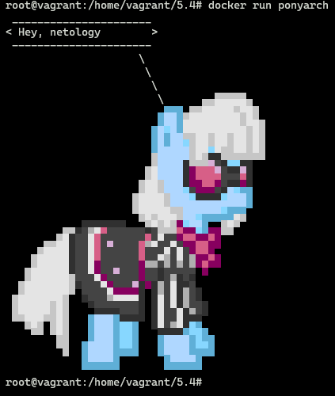
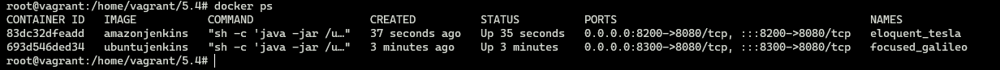
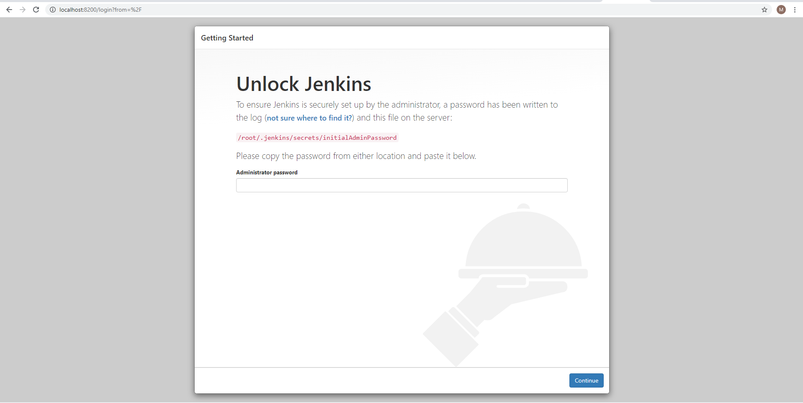
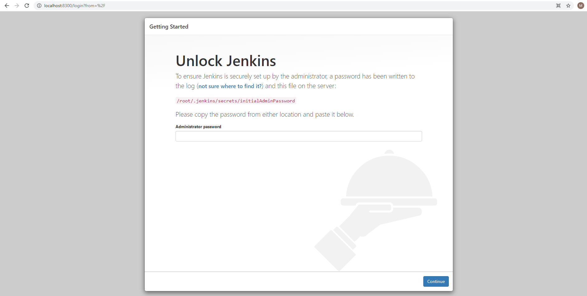
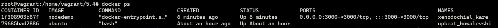
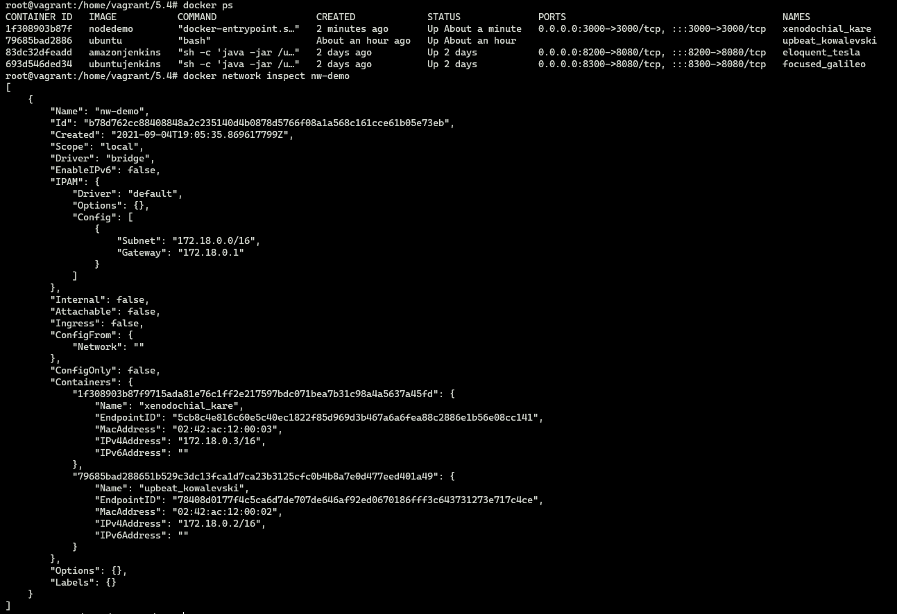
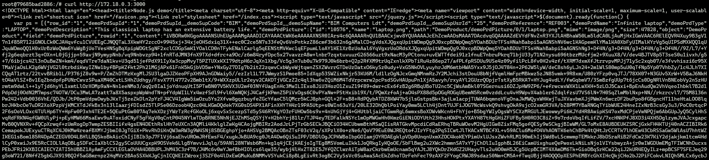

#1
````text
FROM archlinux:latest

RUN pacman -Syy && \
    pacman -Syu --noconfirm ponysay

ENTRYPOINT ["ponysay"]
CMD ["Hey, netology"]

````



https://hub.docker.com/layers/165589847/maxnelipin/devops-netology/5.4_ponyarch/images/sha256-859907120fc39bcc9f730dc294de25f1ecaef04d80916059bcc70e542cc18f3e?context=repo

#2


````text
FROM amazoncorretto

RUN yum -y update && yum -y install wget && amazon-linux-extras install epel -y
RUN wget -O /etc/yum.repos.d/jenkins.repo https://pkg.jenkins.io/redhat-stable/jenkins.repo && \
    rpm --import https://pkg.jenkins.io/redhat-stable/jenkins.io.key && \
    yum -y install jenkins

CMD [ "sh", "-c", "java -jar /usr/lib/jenkins/jenkins.war"]
````


https://hub.docker.com/layers/165847782/maxnelipin/devops-netology/5.4_jenkins_ver1/images/sha256-ba4da3d1dabc3541d530eee049a0583ccb014e9a02e06ac54f1af13e88fbb3aa?context=repo

````text
FROM ubuntu

RUN apt-get -y update && apt-get -y install wget gnupg2
RUN wget -q -O - https://pkg.jenkins.io/debian-stable/jenkins.io.key | apt-key add - && \
RUN bash -c 'echo deb http://pkg.jenkins.io/debian-stable binary/ > /etc/apt/sources.list.d/jenkins.list'
RUN apt-get -y update
RUN apt-get -y install jenkins
RUN apt-get -y install openjdk-11-jdk

CMD [ "sh", "-c", "java -jar /usr/share/jenkins/jenkins.war"]
````


https://hub.docker.com/layers/165847820/maxnelipin/devops-netology/5.4_jenkins_ver2/images/sha256-0e987aee71ec6815873446f2d19826e5d2de5693cbf54b871820c9aaf8e96722?context=repo

#3
````text
FROM node

WORKDIR /var/nodedemo

RUN git clone https://github.com/simplicitesoftware/nodejs-demo.git

WORKDIR /var/nodedemo/nodejs-demo

RUN npm install simplicite

RUN npm install

EXPOSE 3000

CMD ["sh", "-c", "node app.js 0.0.0.0 3000"]
````



