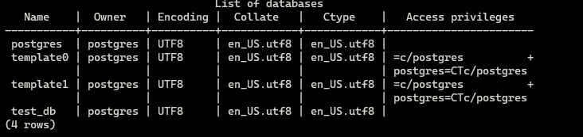
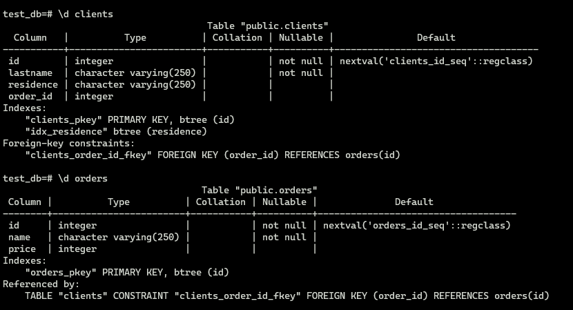

#1.
````bash
docker run -d --rm -e POSTGRES_PASSWORD=123 -v pg_bk_6.2:/var/lib/postgresql/backup pg_data_6.2:/var/lib/postgresql/data pg
````
````text
FROM postgres:12.8

RUN mkdir /var/lib/postgresql/backup  && chown -R postgres:postgres /var/lib/postgresql/backup

VOLUME ["/var/lib/postgresql/backup"]

````
#2.




````text
 select
 *
from information_schema.role_table_grants
where grantee='test-simple-user'
;
````
#3
````text
test_db=# INSERT INTO orders (name, price) VALUES
test_db-#     ('Шоколад', '10'),
test_db-#     ('Принтер', '3000'),
test_db-#  ('Книга', '500'),
test_db-#  ('Монитор', '7000'),
test_db-#  ('Гитара', '4000')
test_db-#  ;
INSERT 0 5
test_db=# INSERT INTO clients (lastname, residence) VALUES
test_db-#     ('Иванов Иван Иванович', 'USA'),
test_db-#     ('Петров Петр Петрович', 'Canada'),
test_db-#  ('Иоганн Себастьян Бах', 'Japan'),
test_db-#  ('Ронни Джеймс Дио', 'Russia'),
test_db-#  ('Ritchie Blackmore', 'Russia')
test_db-#  ;
INSERT 0 5
test_db=# SELECT COUNT(*) FROM clients;
 count
-------
     5
(1 row)

test_db=# SELECT COUNT(*) FROM orders;
 count
-------
     5
(1 row)

````
#4
````text
test_db=# UPDATE clients SET order_id = 3 WHERE id=1;
UPDATE 1
test_db=# UPDATE clients SET order_id = 4 WHERE id=2;
UPDATE 1
test_db=# UPDATE clients SET order_id = 5 WHERE id=3;
UPDATE 1

test_db=# SELECT c.lastname, o.name FROM clients c  INNER JOIN orders o ON o.id = c.order_id;
       lastname       |  name
----------------------+---------
 Иванов Иван Иванович | Книга
 Петров Петр Петрович | Монитор
 Иоганн Себастьян Бах | Гитара
(3 rows)
````

#5
````text

test_db=# EXPLAIN SELECT c.lastname, o.name FROM clients c  INNER JOIN orders o ON o.id = c.order_id;
                               QUERY PLAN
-------------------------------------------------------------------------
 Hash Join  (cost=11.57..24.20 rows=70 width=1032)
   Hash Cond: (o.id = c.order_id)
   ->  Seq Scan on orders o  (cost=0.00..11.40 rows=140 width=520)
   ->  Hash  (cost=10.70..10.70 rows=70 width=520)
         ->  Seq Scan on clients c  (cost=0.00..10.70 rows=70 width=520)
(5 rows)

````
Сначала проивзодится сканирование таблицы clients и для каждой её строки вычисляется хэш. Затем сканируется таблица orders 
и для каждой строки этой таблицы вычисляется хэш, который сравнивается (Hash Join) с хэшем таблицы clients по условию Hash Cond.

#6
Бэкап в папке с бэкапом
````shell
#Бэкапим
root@882e952d88dc:/var/lib/postgresql/backup# pg_dump -Upostgres test_db > test_db.dmp
#Перед восстановлением нужно создать пользователей и базу
root@7d65590ee782:/# createuser "test-admin-user" -P -Upostgres
root@7d65590ee782:/# createuser "test-simple-user" -P -Upostgres
root@7d65590ee782:/# createdb -T template0 test_db -Upostgres
#Восстанавливаем
root@7d65590ee782:/# psql test_db < /var/lib/postgresql/backup/test_db.dmp -Upostgres
SET
SET
SET
SET
SET
 set_config
------------

(1 row)

SET
SET
SET
SET
SET
SET
CREATE TABLE
ALTER TABLE
CREATE SEQUENCE
ALTER TABLE
ALTER SEQUENCE
CREATE TABLE
ALTER TABLE
CREATE SEQUENCE
ALTER TABLE
ALTER SEQUENCE
ALTER TABLE
ALTER TABLE
COPY 5
COPY 5
 setval
--------
      5
(1 row)

 setval
--------
      5
(1 row)

ALTER TABLE
ALTER TABLE
CREATE INDEX
ALTER TABLE
GRANT
GRANT
GRANT
GRANT
root@7d65590ee782:/#

````