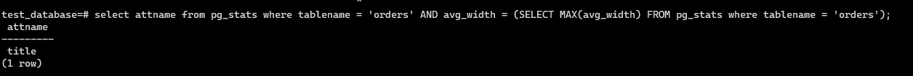

#1.

- вывода списка БД - \l
- подключения к БД - \c DATABASE
- вывода списка таблиц -  \d
- вывода описания содержимого таблиц - \d TABLENAME
- выхода из psql - \q, exit, quit

#2.

 


#3.
```text
CREATE TABLE orders_1 (CHECK (price > 499)) INHERITS (orders);
CREATE TABLE orders_2 (CHECK (price <= 499)) INHERITS (orders);
CREATE RULE orders_insert_1 AS ON INSERT TO orders WHERE (price > 499) DO INSERT INTO orders_1 VALUES (NEW.*);
CREATE RULE orders_insert_2 AS ON INSERT TO orders WHERE (price <= 499) DO INSERT INTO orders_2 VALUES (NEW.*);

```
Да, можно если есть достаточно исходных данных. Пример такого запроса ниже

```shell
CREATE TABLE temperature (
  id BIGSERIAL NOT NULL,
  city_id INT NOT NULL,
  timestamp TIMESTAMP NOT NULL,
  temp DECIMAL(5,2) NOT NULL
) PARTITION BY RANGE (timestamp);
  
  
CREATE TABLE temperature_201901 PARTITION OF temperature FOR VALUES FROM ('2019-01-01') TO ('2019-02-01');
CREATE TABLE temperature_201902 PARTITION OF temperature FOR VALUES FROM ('2019-02-01') TO ('2019-03-01');
CREATE TABLE temperature_201903 PARTITION OF temperature FOR VALUES FROM ('2019-03-01') TO ('2019-04-01');


```


#4
Добавил бы при создании таблицы параметр UNIQUE столбца title

```text
--
-- PostgreSQL database dump
--

-- Dumped from database version 13.4 (Debian 13.4-1.pgdg100+1)
-- Dumped by pg_dump version 13.4 (Debian 13.4-1.pgdg100+1)

SET statement_timeout = 0;
SET lock_timeout = 0;
SET idle_in_transaction_session_timeout = 0;
SET client_encoding = 'UTF8';
SET standard_conforming_strings = on;
SELECT pg_catalog.set_config('search_path', '', false);
SET check_function_bodies = false;
SET xmloption = content;
SET client_min_messages = warning;
SET row_security = off;

SET default_tablespace = '';

SET default_table_access_method = heap;

--
-- Name: orders; Type: TABLE; Schema: public; Owner: postgres
--

CREATE TABLE public.orders (
    id integer NOT NULL,
    title character varying(80) UNIQUE NOT NULL,
    price integer DEFAULT 0
);


ALTER TABLE public.orders OWNER TO postgres;

--
-- Name: orders_id_seq; Type: SEQUENCE; Schema: public; Owner: postgres
--

CREATE SEQUENCE public.orders_id_seq
    AS integer
    START WITH 1
    INCREMENT BY 1
    NO MINVALUE
    NO MAXVALUE
    CACHE 1;


ALTER TABLE public.orders_id_seq OWNER TO postgres;

--
-- Name: orders_id_seq; Type: SEQUENCE OWNED BY; Schema: public; Owner: postgres
--

ALTER SEQUENCE public.orders_id_seq OWNED BY public.orders.id;


--
-- Name: orders id; Type: DEFAULT; Schema: public; Owner: postgres
--

ALTER TABLE ONLY public.orders ALTER COLUMN id SET DEFAULT nextval('public.orders_id_seq'::regclass);


--
-- Data for Name: orders; Type: TABLE DATA; Schema: public; Owner: postgres
--

COPY public.orders (id, title, price) FROM stdin;
1       War and peace   100
2       My little database      500
3       Adventure psql time     300
4       Server gravity falls    300
5       Log gossips     123
6       WAL never lies  900
7       Me and my bash-pet      499
8       Dbiezdmin       501
\.


--
-- Name: orders_id_seq; Type: SEQUENCE SET; Schema: public; Owner: postgres
--

SELECT pg_catalog.setval('public.orders_id_seq', 8, true);


--
-- Name: orders orders_pkey; Type: CONSTRAINT; Schema: public; Owner: postgres
--

ALTER TABLE ONLY public.orders
    ADD CONSTRAINT orders_pkey PRIMARY KEY (id);


--
-- PostgreSQL database dump complete
--
```
База после Шардирования таблицы orders

```shell
--
-- PostgreSQL database dump
--

-- Dumped from database version 13.4 (Debian 13.4-1.pgdg100+1)
-- Dumped by pg_dump version 13.4 (Debian 13.4-1.pgdg100+1)

SET statement_timeout = 0;
SET lock_timeout = 0;
SET idle_in_transaction_session_timeout = 0;
SET client_encoding = 'UTF8';
SET standard_conforming_strings = on;
SELECT pg_catalog.set_config('search_path', '', false);
SET check_function_bodies = false;
SET xmloption = content;
SET client_min_messages = warning;
SET row_security = off;

SET default_tablespace = '';

SET default_table_access_method = heap;

--
-- Name: orders; Type: TABLE; Schema: public; Owner: postgres
--

CREATE TABLE public.orders (
    id integer NOT NULL,
    title character varying(80) UNIQUE NOT NULL ,
    price integer DEFAULT 0
);


ALTER TABLE public.orders OWNER TO postgres;

--
-- Name: orders_1; Type: TABLE; Schema: public; Owner: postgres
--

CREATE TABLE public.orders_1 (
    CONSTRAINT orders_1_price_check CHECK ((price > 499))
)
INHERITS (public.orders);


ALTER TABLE public.orders_1 OWNER TO postgres;

--
-- Name: orders_2; Type: TABLE; Schema: public; Owner: postgres
--

CREATE TABLE public.orders_2 (
    CONSTRAINT orders_2_price_check CHECK ((price <= 499))
)
INHERITS (public.orders);


ALTER TABLE public.orders_2 OWNER TO postgres;

--
-- Name: orders_id_seq; Type: SEQUENCE; Schema: public; Owner: postgres
--

CREATE SEQUENCE public.orders_id_seq
    AS integer
    START WITH 1
    INCREMENT BY 1
    NO MINVALUE
    NO MAXVALUE
    CACHE 1;


ALTER TABLE public.orders_id_seq OWNER TO postgres;

--
-- Name: orders_id_seq; Type: SEQUENCE OWNED BY; Schema: public; Owner: postgres
--

ALTER SEQUENCE public.orders_id_seq OWNED BY public.orders.id;


--
-- Name: orders id; Type: DEFAULT; Schema: public; Owner: postgres
--

ALTER TABLE ONLY public.orders ALTER COLUMN id SET DEFAULT nextval('public.orders_id_seq'::regclass);


--
-- Name: orders_1 id; Type: DEFAULT; Schema: public; Owner: postgres
--

ALTER TABLE ONLY public.orders_1 ALTER COLUMN id SET DEFAULT nextval('public.orders_id_seq'::regclass);


--
-- Name: orders_1 price; Type: DEFAULT; Schema: public; Owner: postgres
--

ALTER TABLE ONLY public.orders_1 ALTER COLUMN price SET DEFAULT 0;


--
-- Name: orders_2 id; Type: DEFAULT; Schema: public; Owner: postgres
--

ALTER TABLE ONLY public.orders_2 ALTER COLUMN id SET DEFAULT nextval('public.orders_id_seq'::regclass);


--
-- Name: orders_2 price; Type: DEFAULT; Schema: public; Owner: postgres
--

ALTER TABLE ONLY public.orders_2 ALTER COLUMN price SET DEFAULT 0;


--
-- Data for Name: orders; Type: TABLE DATA; Schema: public; Owner: postgres
--

COPY public.orders (id, title, price) FROM stdin;
1       War and peace   100
2       My little database      500
3       Adventure psql time     300
4       Server gravity falls    300
5       Log gossips     123
6       WAL never lies  900
7       Me and my bash-pet      499
8       Dbiezdmin       501
11      buggati 450
13      buggati 588
\.


--
-- Data for Name: orders_1; Type: TABLE DATA; Schema: public; Owner: postgres
--

COPY public.orders_1 (id, title, price) FROM stdin;
14      buggati 588
\.


--
-- Data for Name: orders_2; Type: TABLE DATA; Schema: public; Owner: postgres
--

COPY public.orders_2 (id, title, price) FROM stdin;
12      buggati 450
\.


--
-- Name: orders_id_seq; Type: SEQUENCE SET; Schema: public; Owner: postgres
--

SELECT pg_catalog.setval('public.orders_id_seq', 14, true);


--
-- Name: orders orders_pkey; Type: CONSTRAINT; Schema: public; Owner: postgres
--

ALTER TABLE ONLY public.orders
    ADD CONSTRAINT orders_pkey PRIMARY KEY (id);


--
-- Name: orders orders_insert_1; Type: RULE; Schema: public; Owner: postgres
--

CREATE RULE orders_insert_1 AS
    ON INSERT TO public.orders
   WHERE (new.price > 499) DO  INSERT INTO public.orders_1 (id, title, price)
  VALUES (new.id, new.title, new.price);


--
-- Name: orders orders_insert_2; Type: RULE; Schema: public; Owner: postgres
--

CREATE RULE orders_insert_2 AS
    ON INSERT TO public.orders
   WHERE (new.price <= 499) DO  INSERT INTO public.orders_2 (id, title, price)
  VALUES (new.id, new.title, new.price);


--
-- PostgreSQL database dump complete
--
```