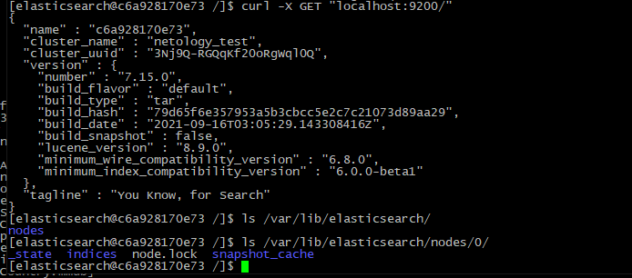
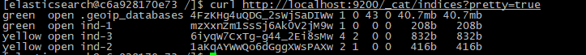
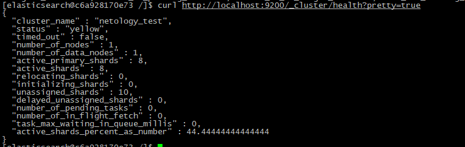

#1.
```shell
FROM centos:7

RUN yum -y update && \
yum -y install wget && \
yum -y install perl-Digest-SHA && \
yum -y install java-11-openjdk-devel && \
export ES_JAVA_HOME=/usr/ && \
cd /mnt && \
wget https://artifacts.elastic.co/downloads/elasticsearch/elasticsearch-7.15.0-darwin-x86_64.tar.gz && \
wget https://artifacts.elastic.co/downloads/elasticsearch/elasticsearch-7.15.0-darwin-x86_64.tar.gz.sha512 && \
shasum -a 512 -c elasticsearch-7.15.0-darwin-x86_64.tar.gz.sha512 && \
tar -xzf elasticsearch-7.15.0-darwin-x86_64.tar.gz && \
cd elasticsearch-7.15.0/

RUN useradd elasticsearch && \
chown -R elasticsearch:elasticsearch /mnt/elasticsearch-7.15.0/ && \
mkdir /var/lib/elasticsearch && \
chown -R elasticsearch:elasticsearch /var/lib/elasticsearch

RUN bash -c 'echo -e "xpack.ml.enabled: false\ncluster.name: netology_test\npath.data: /var/lib/elasticsearch" >> /mnt/elasticsearch-7.15.0/config/elasticsearch.yml'

ENV ES_JAVA_HOME=/usr/

USER elasticsearch

CMD ["/bin/sh", "-c", "/mnt/elasticsearch-7.15.0/bin/elasticsearch"]

```



Ссылка на репозиторий

https://hub.docker.com/layers/169052238/maxnelipin/devops-netology/6.5_elasticsearch/images/sha256-4fc85bb35ce1539148c5538c060526f8e2cc0de6194675d836a508edd47780a4?context=repo


#2.



Желтый статус — потому что в кластере нет реплик, соответственно, сами реплики шард хранить негде



#3.
Новый репозиторий
```shell
[elasticsearch@070169225bd0 /]$ curl -H "Content-Type: application/json" -X PUT  http://localhost:9200/_snapshot/netology_backup -d '{ "type": "fs", "settings": {
   "location":"/mnt/elasticsearch-7.15.0/snapshots"
  }}'
{"acknowledged":true}
```

Новый индекм
```shell
[elasticsearch@070169225bd0 /]$ curl http://localhost:9200/_cat/indices?pretty=true
green open .geoip_databases ZBP7ke4eTXeSM7tz9MrTVA 1 0 43 0 40.7mb 40.7mb
green open test             aIvJTDNFS8GteYbnDPjFSw 1 0  0 0   208b   208b
```

Файлы в каталоге репозитория
```shell
[elasticsearch@070169225bd0 /]$ ls -la /mnt/elasticsearch-7.15.0/snapshots/
total 52
drwxr-xr-x 1 elasticsearch elasticsearch  4096 Sep 26 13:18 .
drwxr-xr-x 1 elasticsearch elasticsearch  4096 Sep 26 13:05 ..
-rw-r--r-- 1 elasticsearch elasticsearch   827 Sep 26 13:18 index-0
-rw-r--r-- 1 elasticsearch elasticsearch     8 Sep 26 13:18 index.latest
drwxr-xr-x 4 elasticsearch elasticsearch  4096 Sep 26 13:18 indices
-rw-r--r-- 1 elasticsearch elasticsearch 21942 Sep 26 13:18 meta-GqG00kJNRpaNpBEwgKXz0A.dat
-rw-r--r-- 1 elasticsearch elasticsearch   436 Sep 26 13:18 snap-GqG00kJNRpaNpBEwgKXz0A.dat
```

Удалён test создан test-2
```shell
[elasticsearch@070169225bd0 /]$ curl http://localhost:9200/_cat/indices?pretty=true
green open .geoip_databases ZBP7ke4eTXeSM7tz9MrTVA 1 0 43 0 40.7mb 40.7mb
green open test-2           ZTQAqWeAQLSsWQbWfJspGg 1 0  0 0   208b   208b
```

Результаты восстановления

```shell
curl -H "Content-Type: application/json" -X POST "http://localhost:9200/_snapshot/netology_backup/snapshot1/_restore" -d '{"indices":"test"}'

[elasticsearch@070169225bd0 /]$ curl http://localhost:9200/_cat/indices?pretty=true
green open .geoip_databases ZBP7ke4eTXeSM7tz9MrTVA 1 0 43 0 40.7mb 40.7mb
green open test-2           ZTQAqWeAQLSsWQbWfJspGg 1 0  0 0   208b   208b
green open test             cRyDUl-JT8u0I2S0vtd66Q 1 0  0 0   208b   208b

```


