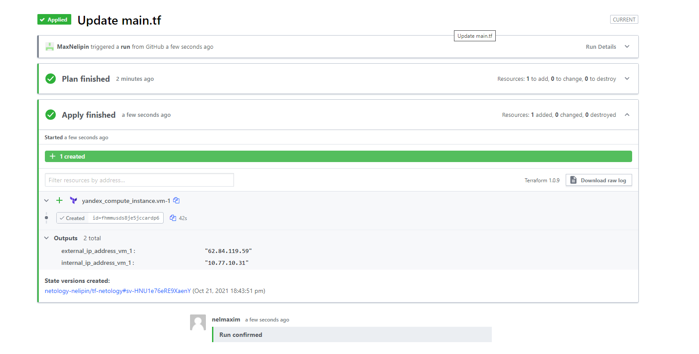
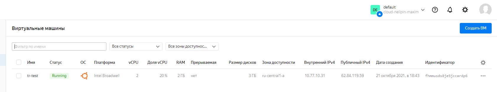

#1.







Яндекс не любит нижние подчеркивания в Name и требует отдельных ролей на создание сети

#3.

Создавать определённо проще (хоть я и работал с Яндекс только в рамках обучения), т.к. уходят на второй план детали реализации, например,
сети и не нужно углубляться в детали, что не всегда нужно, особенно на тестовых средах

```terraform
provider "aws" {
  region = local.region
}

locals {
  name   = "ec2-teamwork"
  region = "eu-west-1"

}
module "vpc" {
  source  = "terraform-aws-modules/vpc/aws"
  version = "~> 3.0"

  name = local.name
  cidr = "10.99.0.0/18"

  azs              = ["${local.region}a", "${local.region}b", "${local.region}c"]
  private_subnets  = ["10.99.3.0/24", "10.99.4.0/24", "10.99.5.0/24"]

  
}

data "aws_ami" "amazon_linux" {
  most_recent = true
  owners      = ["amazon"]

  filter {
    name   = "name"
    values = ["amzn-ami-hvm-*-x86_64-gp2"]
  }
}

module "ec2_t3" {
  source = "../../"

  name = "${local.name}-t3-unlimited"

  ami                         = data.aws_ami.amazon_linux.id
  instance_type               = "t3.micro"
  subnet_id                   = element(module.vpc.private_subnets, 0)
}


```
В случае Яндекса модуль подходит максимум для dev-разработки, т.к. приносит только упрощение синтаксиса конфигурации:
```terraform
provider "yandex" {
  //token     = "<OAuth>"
  cloud_id  = "b1ghq301023687quik6d"
  folder_id = "b1gpooj85mh91so024vc"
  zone      = "ru-central1-a"
}
resource "yandex_vpc_network" "network-1" {
  name = "network1"
}

resource "yandex_vpc_subnet" "subnet-1" {
  name           = "subnet1"
  zone           = "ru-central1-a"
  network_id     = yandex_vpc_network.network-1.id
  v4_cidr_blocks = ["10.77.10.0/24"]
}
module "compute" {
  source  = "glavk/compute/yandex"
  version = "0.1.2"

  image_family = "ubuntu-2004-lts"
  subnet       = "subnet-1"
  folder_id    = "b1gpooj85mh91so024vc"

  name     = "tr-test"
  is_nat   = true

  cores  = 2
  memory = 4

}
```
